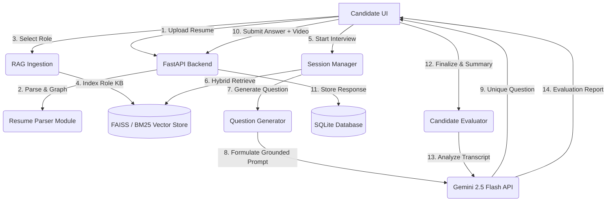

# 🚀 AIMI: AI-Powered Candidate Screening & Interactive Interview Platform

AIMI is a comprehensive, production-grade intelligent candidate screening and mock interview system. It leverages a custom **Hybrid Agentic Retrieval-Augmented Generation (RAG)** pipeline and the **Gemini 2.5 Flash API** to dynamically conduct personalized, resume-grounded technical interviews.

The platform parses a candidate's resume, builds a visual skill-to-experience knowledge graph, conducts a multi-question interactive interview with real-time video response capture, and generates a granular, Gemini-powered candidate evaluation report.

---

## 🎯 Key Capabilities

*   **Resume Parsing & Knowledge Graphs:** Automatically extracts structured data (skills, experience years, domain, and projects) from PDF, DOCX, or TXT resumes, constructing an interactive profile map.
*   **Hybrid RAG Architecture:** Employs a dual-layer search system combining dense vector search (**FAISS**) with lexical keyword search (**BM25**) using Reciprocal Rank Fusion (RRF) at an 85% resume to 15% role-knowledge ratio.
*   **Adaptive Question Generation:** Automatically rotates between 6 distinct interview categories (*Conceptual, Project-based, Debugging, Deployment, Scenario-based, and Real-world*) while adjusting difficulty (Basic to Intermediate) based on the candidate's actual experience level.
*   **Strict Whitelist Grounding:** Ensures absolute context alignment by validating that generated questions only reference technologies, tools, and projects explicitly present in the candidate's resume, avoiding any AI hallucinated terms.
*   **Deep Semantic Deduplication:** Employs sentence-transformer embeddings (`all-MiniLM-L6-v2`) with a similarity threshold of `0.75` and pulls question history cross-session to guarantee candidates never receive duplicate or redundant questions.
*   **Gemini-Powered Evaluation System:** Evaluates candidate response transcripts on technical accuracy, depth of knowledge, communication clarity, and confidence. Provides quantitative scores (0-100), readiness levels, strengths, weak areas, and actionable improvement recommendations.
*   **Interactive Video & Audio Interviews:** Enables candidates to record high-fidelity video answers through the browser's `MediaRecorder` API, which are automatically uploaded and stored on the backend.
*   **Live Interview Insights Dashboard:** A real-time telemetry panel in the frontend showing active question type, difficulty, expected answer depth, and dynamic recording progress metrics.
*   **Secure Session Persistence:** End-to-end user registration and login authenticated via JWT tokens, with interview state saved to a relational SQLite database, permitting users to pause and resume interviews seamlessly.

---

## 🏗️ System Architecture

AIMI is split into a modular FastAPI Python backend and a React/Vite/CSS3 frontend.

### Component Interaction Flow



### Detailed Project Directory Layout

```
.
├── backend/
│   ├── main.py                          # FastAPI Entrypoint & Routing Controllers
│   ├── requirements.txt                 # Backend Python Dependencies
│   ├── .env.example                     # Environment Configuration Template
│   ├── .env                             # Active Local Configuration
│   ├── interview_system.db              # Persistent SQLite Database
│   ├── README.md                        # Backend Module Documentation
│   ├── recordings/                      # Directory for uploaded WebM candidate videos
│   └── modules/
│       ├── resume_parser.py             # Parses text/PDF/DOCX, creates Candidate Graph
│       ├── rag_pipeline.py              # Custom Hybrid FAISS + BM25 + RRF Retriever
│       ├── question_generator.py        # 6-Category Rotation & Grounded Question Logic
│       ├── llm_service.py               # Whitelisting Prompt Assembly & Gemini Controller
│       ├── evaluation.py                # Gemini-based Q&A transcript scorer and reporter
│       ├── database.py                  # Persistence & SQL Query Engine
│       ├── session_manager.py           # Session lifecycles & Auth hooks
│       └── __init__.py
│
├── frontend/
│   ├── package.json                     # Frontend Node Dependencies
│   ├── vite.config.js                   # Vite Bundler Setup
│   ├── .env.local                       # Local Environment Constants (VITE_API_URL)
│   ├── index.html                       # Base HTML wrapper
│   ├── dist/                            # Production Static Build Directory
│   ├── components/                      # UI Components
│   │   ├── LandingPage.jsx              # Landing & Feature Overview Page
│   │   ├── LandingPage.css
│   │   ├── Login.jsx                    # Modern User Access Panel (Auth)
│   │   ├── Login.css
│   │   ├── Navigation.jsx               # Header & Mode Navigation Bar
│   │   ├── Navigation.css
│   │   ├── ResumeUpload.jsx             # File Drag-and-Drop Parser UI
│   │   ├── ResumeUpload.css
│   │   ├── RoleSelection.jsx            # Targeted Role & Question Count Configurator
│   │   ├── RoleSelection.css
│   │   ├── InterviewFlow.jsx            # Dynamic Q&A, Video Capture & Telemetry Panel
│   │   ├── InterviewFlow.css
│   │   ├── SessionsList.jsx             # Active Session Tracker & Resumption Controller
│   │   ├── SessionsList.css
│   │   ├── InterviewSummary.jsx         # Performance Analytics & Recommendation Reports
│   │   └── InterviewSummary.css
│   └── src/
│       ├── App.jsx                      # App Routes & Central State Coordinator
│       ├── App.css                      # Global Styling System & CSS Variables
│       └── main.jsx                     # DOM Inscription & React mounting
│
├── deployment_guide.md                  # Comprehensive Production Deployment Steps (Railway)
└── README.md                            # Main Workspace Readme (This document)
```

---

## ⚡ Quick Start Guide

### System Prerequisites

*   Python 3.9 or higher installed.
*   Node.js 16 or higher with npm.
*   A Google Gemini API key (retrieve one from [Google AI Studio](https://aistudio.google.com/)).

---

### 1. Backend Inception

1.  **Navigate to the backend directory:**
    ```bash
    cd backend
    ```

2.  **Establish a virtual environment:**
    ```bash
    python -m venv venv
    ```

3.  **Activate the virtual environment:**
    *   **Windows (PowerShell):**
        ```powershell
        .\venv\Scripts\Activate.ps1
        ```
    *   **macOS / Linux:**
        ```bash
        source venv/bin/activate
        ```

4.  **Install python dependencies:**
    ```bash
    pip install -r requirements.txt
    ```

5.  **Provision the configuration environment:**
    Copy `.env.example` to a new file named `.env`. Open it and populate your Gemini API Key:
    ```ini
    JWT_SECRET=super-secret-key-change-in-production
    CORS_ORIGINS=["http://localhost:5173"]
    GEMINI_API_KEY=AIzaSy...your-actual-api-key-here
    ```

6.  **Run the local development server:**
    ```bash
    python main.py
    ```
    *The FastAPI backend will boot and bind to `http://localhost:8000`.*
    *Swagger documentation will be available at `http://localhost:8000/docs`.*

---

### 2. Frontend Launch

1.  **Navigate to the frontend directory:**
    ```bash
    cd ../frontend
    ```

2.  **Install node packages:**
    ```bash
    npm install
    ```

3.  **Setup local environment constants:**
    Create a `.env.local` file under `frontend/` containing:
    ```ini
    VITE_API_URL=http://localhost:8000/api
    ```

4.  **Start the hot-reloading development server:**
    ```bash
    npm run dev
    ```
    *The client interface will spin up at `http://localhost:5173`.*

---

## 🌊 Complete Interview Life Cycle

```
1. Guest Landing Page ──> Sign Up / Log In ──> JWT Auth Token Handshake
                                                    │
2. Drag-and-Drop Resume File (PDF/DOCX/TXT) ────────┘
    └─> Parsing engine maps experience levels & designs Skill Knowledge Graph
                                                    │
3. Select Targeted Role Card (e.g. Backend Engineer) │
    └─> Loads specialized RAG Knowledge Base ───────┘
                                                    │
4. Initializing Interview ──────────────────────────┘
    ├─> Session Ingestion: Lazy Indexes built on the parsed Resume
    ├─> Hybrid vector indices constructed: 85% Resume + 15% Role Knowledge
    └─> Q1 Generator: Rotation pops "Conceptual" Category, validates grounding, serves Q1
                                                    │
5. The Dynamic Q&A Loop (Typically 5 iterations) <──┘
    ├─> Serves question with telemetry metrics (expected depth, category)
    ├─> Candidate records response (audio transcript + camera video file)
    ├─> Submit: Saves video file to recordings/ and saves response details to DB
    ├─> Generator evaluates history (current-session + cross-session role history)
    ├─> Query Generator shuffles topics using session seed to prevent repetition
    └─> Serve Next Question (Rotates: Debugging, Deployment, Scenario-based...)
                                                    │
6. Finalizing Interview ────────────────────────────┘
    ├─> Candidate completes the full rotation of questions
    ├─> Session marked "completed" in persistent DB
    └─> Evaluator constructs structured prompt mapping candidate's resume + transcript
                                                    │
7. Comprehensive Performance Reports <──────────────┘
    ├─> Gemini scores Skill Metrics, Communication, Confidence, and Technical Accuracy
    ├─> Renders graphical analytical summary, detailing key strengths and weak areas
    └─> Provides highly specific improvement suggestions mapped to resume projects
```

---

## 🧠 Core Engineering Principles

### 1. Hybrid Vector RAG Pipeline
Rather than performing a simple scan of the role knowledge base, AIMI indexes the **candidate's structured resume** as a temporary, per-session FAISS index alongside a lexical BM25 database.
*   **Resume Priority (85%):** Ensures the interview focuses on the candidate's actual projects, tools, and background.
*   **Role Alignment (15%):** Injects theoretical industry guidelines based on the targeted role.
*   **Reciprocal Rank Fusion (RRF):** Synthesizes dense semantic similarities from FAISS Flat Inner-Product index with keyword matching from BM25 to yield a unified relevance list.

### 2. Multi-Tier Deduplication & Hallucination Prevention
To maintain high technical interview standards, the question generator executes a strict verification loop:
*   **Historical Memory:** Combines questions from the current interview session and historical questions from the last 10 interviews of the same role in the SQLite database.
*   **Semantic Closeness:** Utilizes sentence embeddings to compute a Cosine-Similarity matrix between proposed and past questions, rejecting any with a closeness score $\ge 0.75$.
*   **Grounding Whitelist:** Compiles a whitelist of all skills, companies, tools, and project titles mentioned in the resume. Proposed questions are scanned, and any question attempting to introduce unlisted technologies (e.g., asking about Kubernetes when the candidate only has basic Docker) is discarded and regenerated.

### 3. Gemini-powered Analytical Evaluation
Upon session completion, the `modules/evaluation.py` controller compiles the exact Q&A transcript and resume metadata.
*   **Evaluation Model:** Utilizes the advanced `gemini-2.5-flash` model.
*   **Structured Outputs:** Constrains response output strictly to an evaluation JSON schema mapping quantitative values to feedback areas.
*   **Graceful Heuristic Fallback:** If API limits are reached or keys are missing, the system utilizes a keyword-density and text-length heuristic evaluator to guarantee the user receives a fallback report rather than an error banner.

---

## 🔒 Security & Persistence Blueprint

*   **Secure API Controllers:** All interactive endpoints under `/api` (uploading, selecting roles, skipping, and submitting questions) are protected behind FastAPIs `HTTPBearer` security middleware requiring a valid JWT token.
*   **Encrypted Storage:** Relational SQLite database preserves user credentials using PBKDF2 password hashing algorithms.
*   **Session State Resumption:** The `/api/resume-interview/{session_id}` controller enables users to restore their interview. If a user gets disconnected, the backend reconstructs their RAG indices, restores the 6-category rotation state, and serves the active question to prevent data loss.

---

## 🌍 Supported Targeted Roles

AIMI supports direct knowledge bases and specialized skill whitelisting for the following roles:
1.  **Backend Engineer:** Databases (ACID, Indexes), API frameworks (FastAPI, Spring), Caching (Redis), System Design.
2.  **AI/ML Engineer:** Supervised/Unsupervised models, Neural networks, Deep Learning libraries (PyTorch, TensorFlow), Gemini/OpenAI API.
3.  **Full Stack Engineer:** Frontend components (React, Hooks), CSS systems, Backend APIs, Git flows, build configs (Vite).
4.  **Data Scientist:** Explanatory analytics (Pandas, Numpy), statistical hypotheses, SQL groupings, visualization dashboards.
5.  **DevOps Engineer:** Dockerization, basic CI/CD automation workflows (GitHub Actions), bash scripting, Linux processes.
6.  **Frontend Developer:** HTML accessibility (ARIA), CSS layouts (Flexbox, Grid), State Management (Context API, Redux), React rendering.
7.  **Data Analyst:** SQL CTEs, window functions (ROW_NUMBER, LAG), Excel pivots, Business KPIs (CAC, LTV, Churn).

---

## 📋 Comprehensive API Endpoints

### User Authentication
*   `POST /api/auth/register` - Create a new user profile.
*   `POST /api/auth/login` - Secure credentials swap returning a JWT token.

### Candidate & Resume Setup
*   `POST /api/upload-resume` - Upload a resume file to parse skills, experience, and projects.
*   `POST /api/select-role` - Pre-load the dense vector chunks for the targeted role knowledge base.

### Interactive Interview Controller
*   `POST /api/start-interview` - Initialize an interview session, build RAG indices, and serve question 1.
*   `POST /api/resume-interview/{session_id}` - Reconstruct indices and resume an active interview.
*   `POST /api/submit-answer` - Upload candidate's answer text, timing, and WebM response video file, then fetch the next question.
*   `POST /api/skip-question` - Register an unanswered question as `[SKIPPED]` and fetch the next question.

### Evaluation & Analytics
*   `GET /api/interview-summary/{session_id}` - Retrieve Q&A transcript, video file paths, and full Gemini analysis.
*   `GET /api/evaluation/{session_id}` - Dedicated analytical report endpoint.
*   `GET /api/sessions` - Retrieve all interview sessions associated with the authenticated user ID.
*   `DELETE /api/sessions/{session_id}` - Delete a session record, associated Q&A pairs, and server video recordings.

---

## 🚀 Production Hosting Instructions

For detailed steps on deploying the FastAPI backend and Vite React frontend as separate, interconnected services, refer to the [Railway Deployment Guide](file:///e:/aiml/deployment_guide.md).

---

**Built with ❤️ for the PG-AGI Internship Program**
